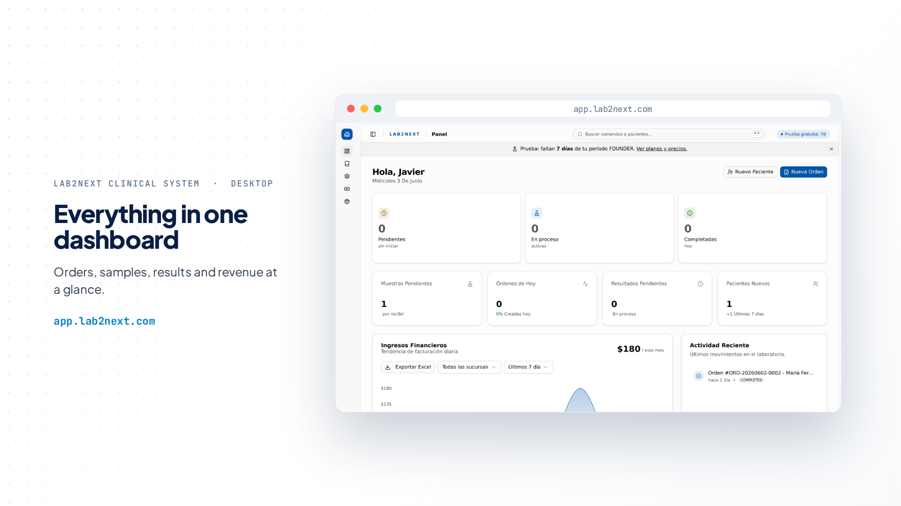
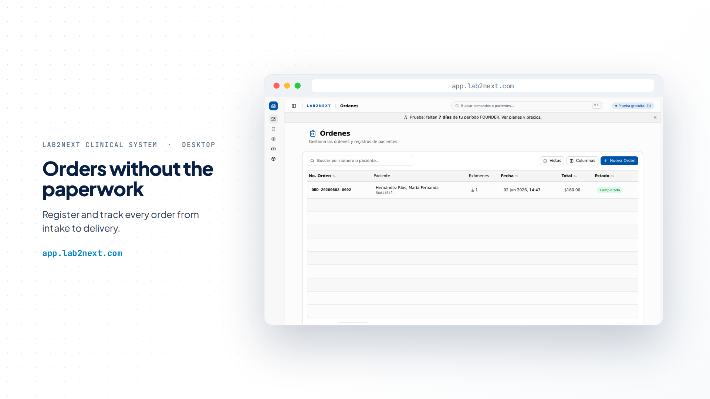
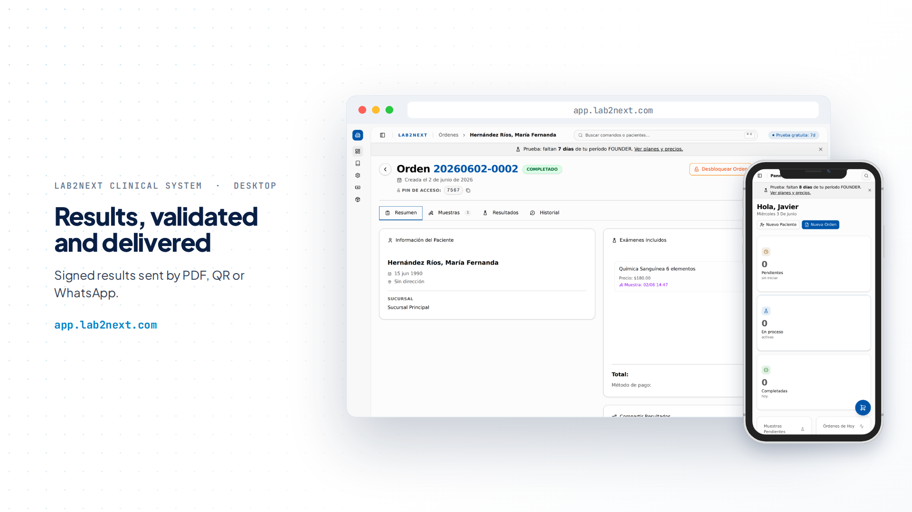
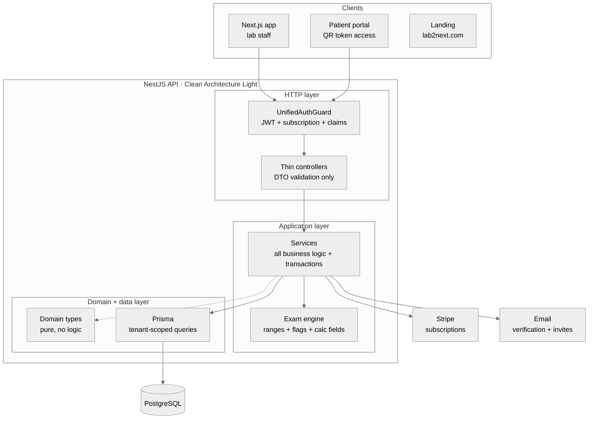

# Lab2Next

A multi-tenant LIS for clinical laboratories, built solo from Figma to production. Live at [**lab2next.com**](https://lab2next.com) · App: [app.lab2next.com](https://app.lab2next.com) · 🎬 [Demo reel](.github/readme/app-tour.mp4)

> **Showcase repository.** Lab2Next is a production SaaS with a private codebase. This repo documents the product, the architecture, and the engineering decisions behind it: no source code, full engineering story. If you are interviewing me and want to go deeper into any decision, ask me.

## The idea

Independent labs in Mexico still run on paper, WhatsApp chats, and software that looks like 1998. The big LIS vendors sell licenses and months of implementation that a small lab in Mérida can't afford. I live here, I talked to the people running these labs, and I built the thing I felt should exist: a lab signs up, finds a curated catalog already loaded, and takes its first order the same day. No installation, no server in the back room, no IT guy.

I built and operate all of it as a single engineer: product, backend, frontend, infra, and billing. In production since May 2026 (public beta Feb to Apr), with 50 registered users and 100+ lab exams processed.

## What's inside

- **The full lab flow**: patient registration, orders, sample collection, result capture and validation, branded PDF reports, patient delivery, billing
- **A visual exam builder**: labs design their own exams with sections, analytes, calculated fields, and reference ranges
- **Typed result capture** with automatic H/L flagging against reference ranges
- **Patient results portal**: passwordless access via signed QR token, shareable by WhatsApp in one click, because most patients here are older people who install nothing
- **Multi-branch and roles**: branch-scoped operation with granular claims-based permissions per user per branch
- **Stripe self-serve subscriptions**: trial, quota enforcement, upgrades and downgrades, no sales call required

The full feature breakdown lives in [docs/features.md](docs/features.md).

## A quick tour

| Everything in one dashboard | Orders without the paperwork |
| --- | --- |
|  |  |

| Results, validated and delivered | The whole system, on mobile |
| --- | --- |
|  |  |

More screens, raw and unframed, in [docs/features.md](docs/features.md).

## Architecture at a glance

- **Multi-tenant by `laboratoryId`**: every query is tenant-scoped, nothing crosses laboratories. Branch context is explicit on top.
- **PBAC (Plan-Based Access Control)**: a 3-tier chain (Plan, Claims, Quotas) enforced server-side on every request by a single composed guard, with CASL as the policy engine and `@RequirePermission()` on every protected route. Permissions travel in the JWT, so authorization costs zero DB hits per request. The frontend mirrors the same claims to hide what the API would reject, but the backend is the enforcement point.
- **Clean Architecture Light**: every module ships the same three layers, `http/` (thin controllers, DTO validation), `application/` (all business logic and transactions), `domain/types/` (pure types). Deliberate pragmatism over ceremony, documented in ADRs.
- **Feature-first frontend**: code organized by domain, hard 500-line component limit, coordinator-only pages, TanStack Query for all server state.

## Deep dives

- [The exam engine](docs/exam-engine.md): the most interesting subsystem. How one global catalog (classified per the Mexican NOM-007-SSA3-2011 regulation) serves every lab's customizations without duplication: metadata overrides, implicit forking, and rule shadowing.
- [Architecture](docs/architecture.md): the full picture, order lifecycle included.
- [Architecture Decision Records](docs/adr): 11 ADRs with rationale, trade-offs, and review triggers.
- [Security](docs/security.md): tenant isolation, signed revocable tokens, rate limiting, verify-first signup, additive-only migrations.

## Stack

| Layer | Stack |
| --- | --- |
| Backend | NestJS 11 · Prisma · PostgreSQL · CASL · Stripe |
| Frontend | Next.js 16 · React 19 · TypeScript · TanStack Query · Tailwind CSS · shadcn/ui |
| Auth | JWT (header + cookie) · claims-based permissions · signed public-access tokens |
| Testing & QA | Playwright (E2E flows with video) · Jest |
| Tooling | pnpm monorepo · ESLint · CI on GitHub |

Mobile-first throughout: reception staff work on tablets and phones at the counter, so every screen ships responsive from the first commit and is verified at 375px. Light and dark themes, both first-class.

## What I'd do differently

Every real project has this list. Mine:

- I would write the Playwright flows earlier; manually QA-ing a multi-role, multi-branch flow stops scaling at the second branch
- The catalog data pipeline deserved version control from day one
- I underestimated how much of a SaaS is not code: pricing, onboarding copy, and support flows took real engineering time

---

Built by [Javier Chi Ortiz](https://javierchiortiz.dev/en) in Mérida, México 🇲🇽 · [LinkedIn](https://www.linkedin.com/in/javier-fernando-chi-ortiz) · [lab2next.com](https://lab2next.com)

All product screenshots show QA/test data. © All rights reserved.
