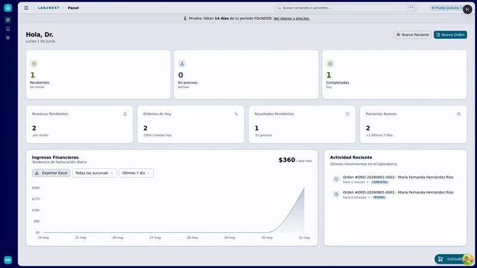
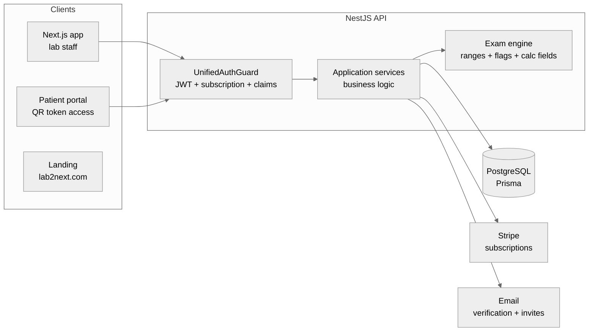
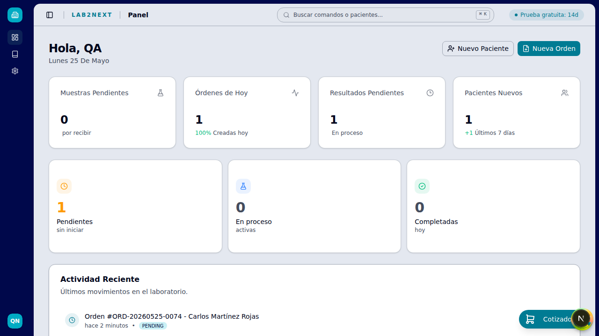
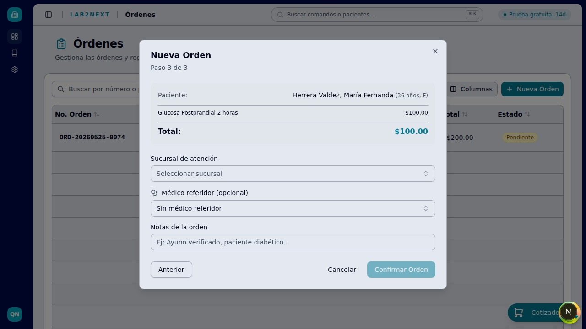

# Lab2Next

Multi-tenant LIS/LIMS for clinical laboratories, built for México and LATAM. Live at **[lab2next.com](https://lab2next.com)**, app at **[app.lab2next.com](https://app.lab2next.com)**.

> The codebase is private. This repo is the showcase: the product, the architecture and the engineering decisions behind it.

## The idea

Independent clinical labs in México still run on paper and software from the 90s, and not the retro-cool kind. The big LIS vendors charge license fees and implementation projects that a small lab simply cannot pay, so they stay on Excel and WhatsApp. I live in Mérida, I talked with these labs and watched how they actually work. Then I built what should already exist: a lab registers and is operating the same day, with no installation, no technicians and no sales call.

The full flow lives in one place: patient registration, orders, sample collection, result capture and validation, PDF report, delivery by QR or WhatsApp, and billing. I designed, built and operate all of it, end to end.

Watch it move: **[app tour, 43s](.github/readme/app-tour.mp4)** · **[registration tutorial, 94s](.github/readme/registration-tutorial.mp4)**

## What's inside

- **Orders and patients**: capture with catalog autocomplete, digital patient records, order history and states
- **Exam catalog with a visual builder**: 155+ preloaded exams classified per NOM-007 (the Mexican lab regulation), editable sections, analytes, calculated fields and reference ranges
- **Result capture with automatic flags**: typed entry (numeric, qualitative, calculated), H/L flagging against the resolved reference ranges
- **Patient results portal**: passwordless access via signed QR token, shareable by WhatsApp in one click
- **PDF reports**: per-lab branded result reports, the document that actually sells the lab
- **Multi-branch with roles**: branch-scoped operation and claims-based permissions per user per branch
- **Appointments**: calendar with per-branch capacity control
- **Stripe subscriptions**: trial, quota enforcement, self-serve upgrades and downgrades
- **Mobile-first**: reception works on phones and tablets at the counter, every screen verified at 375px

On the roadmap: CFDI 4.0 invoicing, analyzer interfacing (HL7/ASTM), public API.

## The exam engine

The hardest design problem in the product. Labs need standard exams from a global curated catalog, but every lab customizes names, prices, methods, units and reference ranges. Copying the whole catalog per lab would explode storage and make global updates impossible.

The solution is a 3-tier personalization strategy:

1. **Metadata overrides**: commercial data (name, price, turnaround) lives in per-lab pivot tables. Zero structural duplication.
2. **Implicit forking**: the exam tree is cloned for a lab only when it mutates structure (adds or removes analytes or sections). Metadata edits never fork.
3. **Rule shadowing**: lab-scoped reference range rules override global rules without duplicating analytes, resolved by a pure filter pipeline at evaluation time.

## Architecture

- **Multi-tenant by `laboratoryId`**: every query is tenant-scoped, nothing crosses laboratories. Branch context is explicit on top.
- **PBAC (Plan-Based Access Control)**: a 3-tier chain (Plan, Claims, Quotas) evaluated by a single composed guard, with CASL as the policy engine. Permissions travel in the JWT, so authorization costs zero DB hits per request.
- **Clean Architecture Light**: thin controllers, business logic exclusively in application services, types-only domain layer. Deliberate pragmatism over ceremony, documented in ADRs.
- **Feature-first frontend**: code organized by domain, hard 500-line component limit, coordinator-only pages, TanStack Query for all server state.
- **Security**: tenant isolation on every query, signed revocable tokens for public result access, rate limiting on public endpoints, verify-first signup (no account exists until the email is verified).
- **Data safety**: additive-only migrations, soft deletes, scripted prod backup and dev restore discipline.

Deep dives: **[Architecture](docs/architecture.md)** · **[Architecture Decision Records](docs/adr-summaries.md)** (11 ADRs with rationale, trade-offs and review triggers)

## A quick tour

| Operational dashboard | Exam catalog (NOM-007 categories, per-lab pricing) |
| --- | --- |
|  |  |

| Exam builder | Analyte configuration with reference ranges |
| --- | --- |
|  |  |

| Order creation wizard | Result capture, automatic high flag |
| --- | --- |
|  |  |

| Landing | Signup to first order in under an hour |
| --- | --- |
|  |  |

| Product modules | The whole system on mobile |
| --- | --- |
|  |  |

## Traction

In production since May 2026, after a public beta that ran from February to April 2026. So far: 50 registered users, 100+ exams processed, and paying labs on the Founder plan. Small numbers, real ones.

## What I'd do differently

Three honest ones:

1. **Enforce component decomposition from day one.** My frontend ADR has a hard 500-line limit per component because I broke it first: the order creation modal grew past 1,000 lines before I wrote the rule, and it is still sitting in my technical debt tracker waiting for its refactor. Decomposition rules cost nothing on day one and a full sprint on month six.
2. **Put the ugliest report in front of real labs sooner.** I have built the PDF report system three times: fixed templates, then per-section configuration, now a block-based designer. Every rewrite was driven by customization needs I would have discovered months earlier by shipping the crudest version to a real lab and watching.
3. **Extract shared logic into a package before it duplicates.** The billing status classifier and the field validation rules each exist twice, one copy per side, frontend and backend, kept in sync by hand and by a note in my docs. In a pnpm monorepo there is no excuse for that: a shared package was always one afternoon away.

## Stack

NestJS 11 · Prisma · PostgreSQL · CASL · Stripe · Next.js 16 · React 19 · TypeScript · TanStack Query · Tailwind CSS · shadcn/ui · Playwright · Jest · pnpm monorepo

---

Designed, built and operated by [Javier Chi](https://javierchiortiz.dev) in Mérida, México. Also on [LinkedIn](https://www.linkedin.com/in/javier-fernando-chi-ortiz) and [GitHub](https://github.com/SpidySamurai), or by [email](mailto:javierchiortiz@gmail.com). All screenshots show QA/test data.
