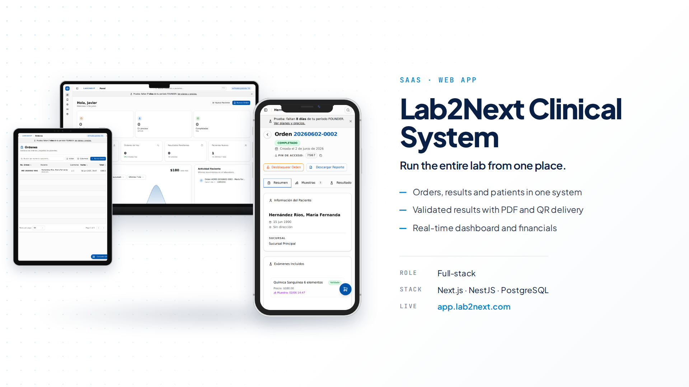
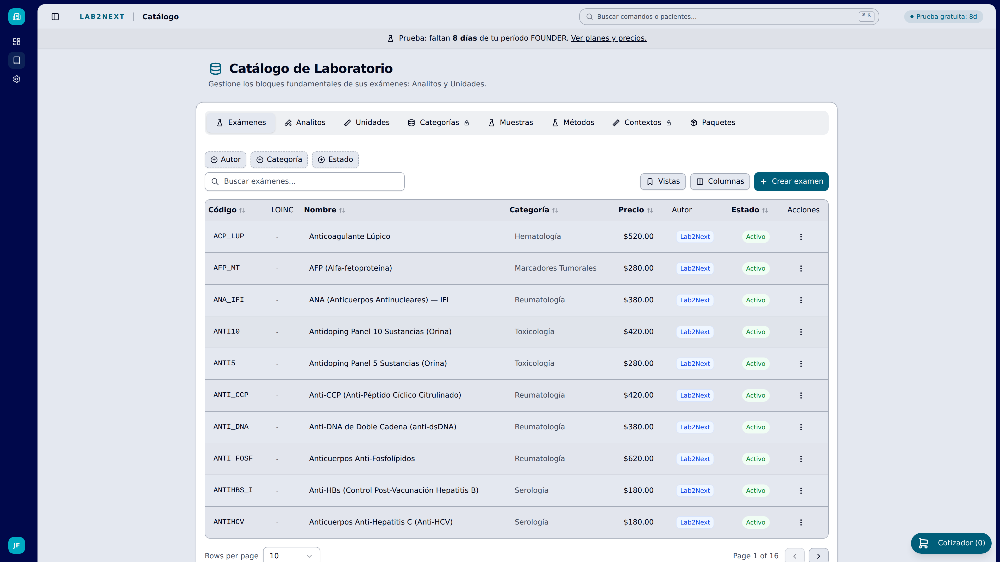
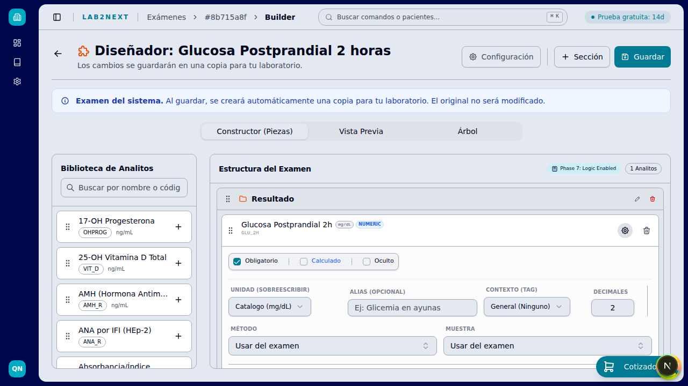
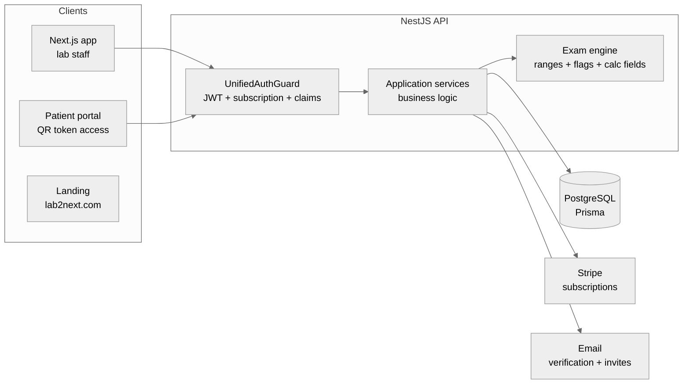
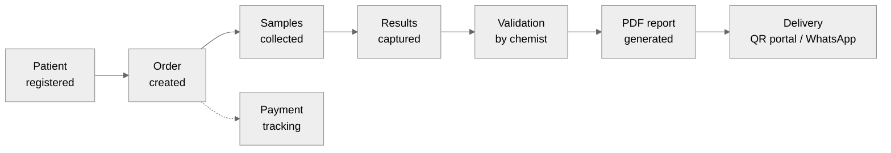
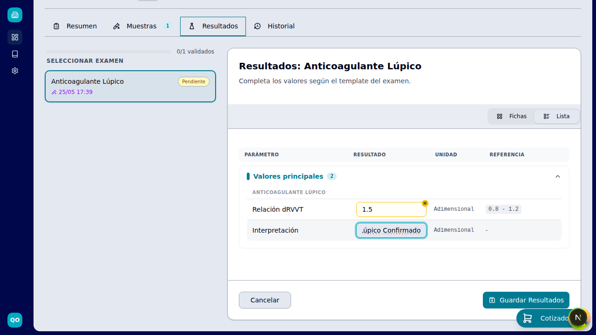
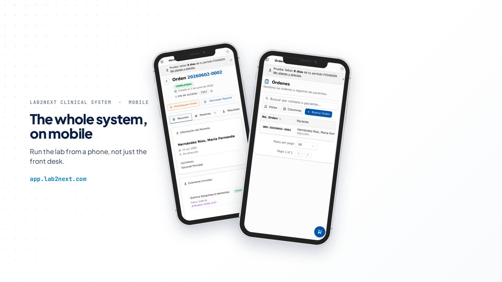
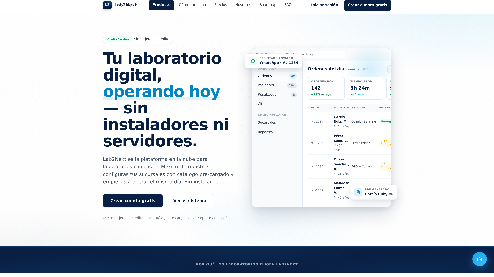
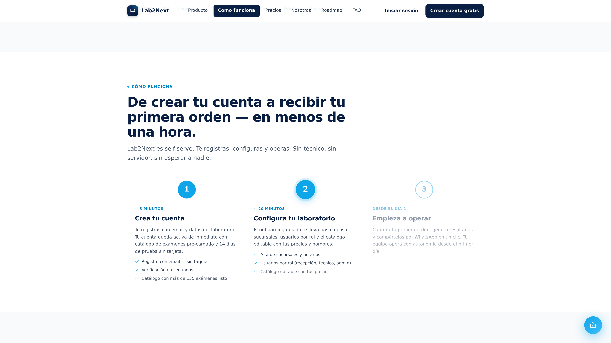
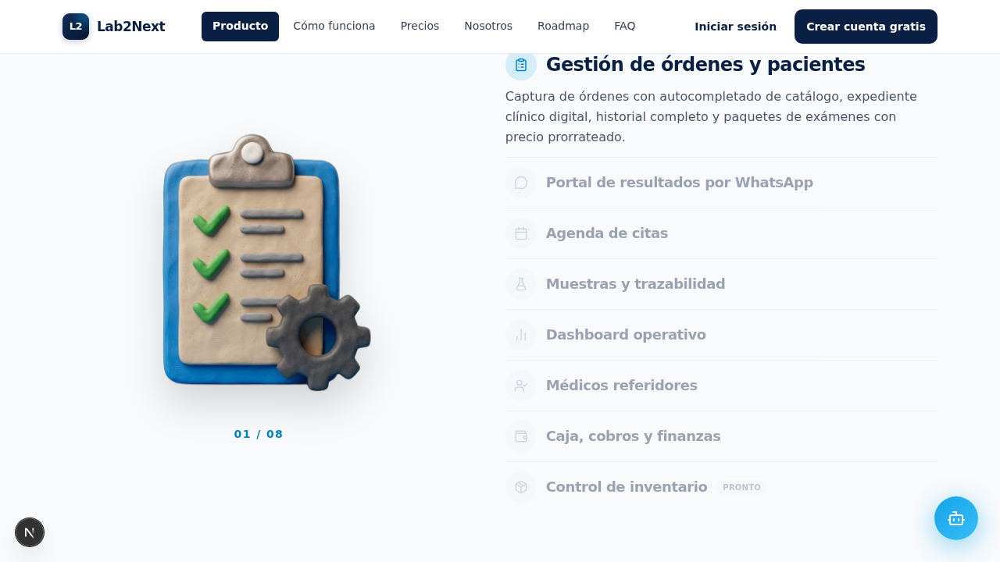

# Lab2Next · Multi-tenant LIS/LIMS for Clinical Laboratories

> **Showcase repository.** Lab2Next is a production SaaS with a private codebase. This repo documents the product, the architecture, and the engineering decisions behind it: no source code, full engineering story.

🌐 **Live:** [lab2next.com](https://lab2next.com) · **App:** [app.lab2next.com](https://app.lab2next.com) · 🎬 **[App tour, 43s](assets/app-tour.mp4)**

---

## Why I built this

Independent clinical labs in Mexico still run on paper and software from the 90s. The big LIS vendors charge license fees and implementation projects that a small lab simply cannot pay, so they stay on Excel and WhatsApp. I live in Mérida, I talked with these labs and watched how they actually work. Then I built what should already exist: a lab registers and is operating the same day, with no installation, no technicians and no sales call.

## What it is

Lab2Next is a cloud LIMS (Laboratory Information Management System) for small and mid-size clinical laboratories in Mexico and LATAM. It covers the full operational flow:

**Patient registration → Orders → Sample collection → Result capture & validation → PDF report → Patient delivery (QR / WhatsApp) → Billing**

Built and operated by a single engineer, end to end: product, backend, frontend, infra, billing.

## Core features (live in production)

| Area | What it does |
|------|--------------|
| **Orders & patients** | Order capture with catalog autocomplete, digital patient records, order history and states |
| **Exam catalog & builder** | Lab-editable catalog with a visual exam designer: sections, analytes, calculated fields, reference ranges |
| **Result capture & validation** | Typed result entry (numeric, qualitative, calculated) with automatic H/L flagging against reference ranges |
| **Patient results portal** | Passwordless access via signed QR token, shareable by WhatsApp in one click |
| **PDF reports** | Per-lab branded result reports, classic and advanced templates |
| **Multi-branch** | Branch-scoped operation, capacity and pricing per branch, plan-gated branch count |
| **Roles & permissions** | Granular claims-based access control per user per branch |
| **Appointments** | Calendar with per-branch capacity control |
| **Subscriptions** | Stripe self-serve billing, trial, quota enforcement, upgrades/downgrades |
| **Referring physicians** | Physician catalog linked to orders |

On the roadmap: CFDI 4.0 invoicing, analyzer interfacing (HL7/ASTM via integration engine), public API.

## The exam engine

The most interesting subsystem. Labs need standard exams (a global curated catalog classified per the Mexican NOM-007-SSA3-2011 regulation) but every lab customizes names, prices, methods, units and reference ranges. Copying the whole catalog per lab would explode storage and make global updates impossible.

The solution is a **3-tier personalization strategy**:

1. **Metadata overrides**: commercial data (name, price, turnaround) lives in per-lab pivot tables. Zero structural duplication.
2. **Implicit forking**: the exam tree is cloned for a lab only when it mutates structure (adds/removes analytes or sections). Metadata edits never fork.
3. **Rule shadowing**: lab-scoped reference range rules override global rules without duplicating analytes, resolved by a pure filter pipeline at evaluation time.

  
  

## Architecture at a glance

- **Multi-tenant by `laboratoryId`**: every query is tenant-scoped, nothing crosses laboratories. Branch context is explicit on top.
- **PBAC (Plan-Based Access Control)**: a 3-tier chain (Plan → Claims → Quotas) evaluated by a single composed guard, with CASL as the policy engine. Permissions travel in the JWT, so authorization costs zero DB hits per request.
- **Clean Architecture Light**: thin controllers, business logic exclusively in application services, types-only domain layer. Deliberate pragmatism over ceremony, documented in ADRs.
- **Feature-first frontend**: code organized by domain, hard 500-line component limit, coordinator-only pages, TanStack Query for all server state.

Deep dives: **[Architecture](docs/architecture.md)** · **[Architecture Decision Records](docs/adr-summaries.md)**

## Order lifecycle

  
  

## Traction

In production since May 2026, after a public beta that ran from February to April 2026. So far: 50 registered users, 100+ exams processed, and paying labs on the Founder plan.

## Tech stack

| Layer | Stack |
|-------|-------|
| Backend | NestJS 11, Prisma, PostgreSQL, CASL, Stripe |
| Frontend | Next.js 16, React 19, TypeScript, TanStack Query, Tailwind CSS, shadcn/ui |
| Auth | JWT (header + cookie), claims-based permissions, signed public-access tokens |
| Testing & QA | Playwright (E2E flows with video), Jest |
| Tooling | pnpm monorepo, ESLint, CI on GitHub |

## Built mobile-first

Reception staff work on tablets and phones at the counter. Every screen ships responsive from the first commit and is verified at 375px.

## Engineering practices

- **ADRs**: 11 Architecture Decision Records govern the codebase (see [summaries](docs/adr-summaries.md)). Decisions include rationale, trade-offs and review triggers.
- **Domain-regulated catalog**: exam classification follows NOM-007-SSA3-2011 (the Mexican clinical lab regulation), cross-mapped to LOINC classes.
- **Security**: tenant isolation on every query, signed revocable tokens for public result access, rate limiting on public endpoints, hardened security headers, verify-first signup (no account exists until email is verified).
- **Data safety**: additive-only migrations, soft deletes, scripted prod backup / dev restore discipline.

## Self-serve onboarding

The product sells and onboards itself: a lab registers, gets a preloaded catalog of 155+ exams, configures branches and roles through guided onboarding, and captures its first order in under an hour. No installers, no servers, no sales call. Watch the real flow: **[registration tutorial, 94s](assets/registration-tutorial.mp4)**.

  
  

## What I'd do differently

Three honest ones:

1. **Enforce component decomposition from day one.** My frontend ADR has a hard 500-line limit per component because I broke it first: the order creation modal grew past 1,000 lines before I wrote the rule, and it is still sitting in my technical debt tracker waiting for its refactor. Decomposition rules cost nothing on day one and a full sprint on month six.
2. **Put the ugliest report in front of real labs sooner.** I have built the PDF report system three times: fixed templates, then per-section configuration, now a block-based designer. Every rewrite was driven by customization needs I would have discovered months earlier by shipping the crudest version to a real lab and watching.
3. **Extract shared logic into a package before it duplicates.** The billing status classifier and the field validation rules each exist twice, one copy per side, frontend and backend, kept in sync by hand and by a note in my docs. In a pnpm monorepo there is no excuse for that: a shared package was always one afternoon away.

---

## About

I'm **Javier Chi**, a full-stack engineer based in Mérida, México. I designed, built and operate Lab2Next end to end.

- Portfolio: [javierchiortiz.dev](https://javierchiortiz.dev)
- LinkedIn: [linkedin.com/in/javier-fernando-chi-ortiz](https://www.linkedin.com/in/javier-fernando-chi-ortiz)
- Product: [lab2next.com](https://lab2next.com)
- Email: [javierchiortiz@gmail.com](mailto:javierchiortiz@gmail.com)
- GitHub: [@SpidySamurai](https://github.com/SpidySamurai)

All product screenshots show QA/test data. © All rights reserved.
