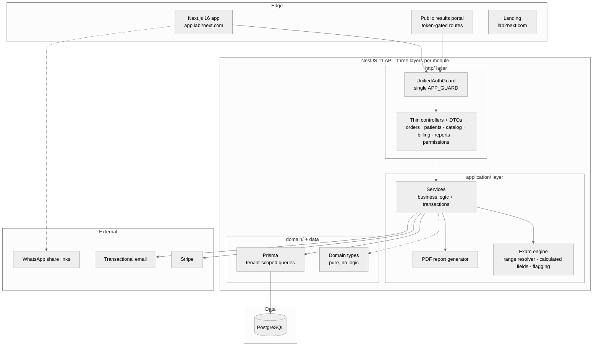
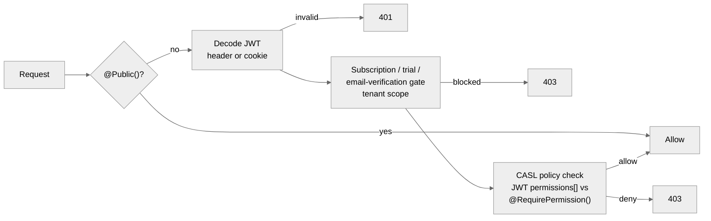
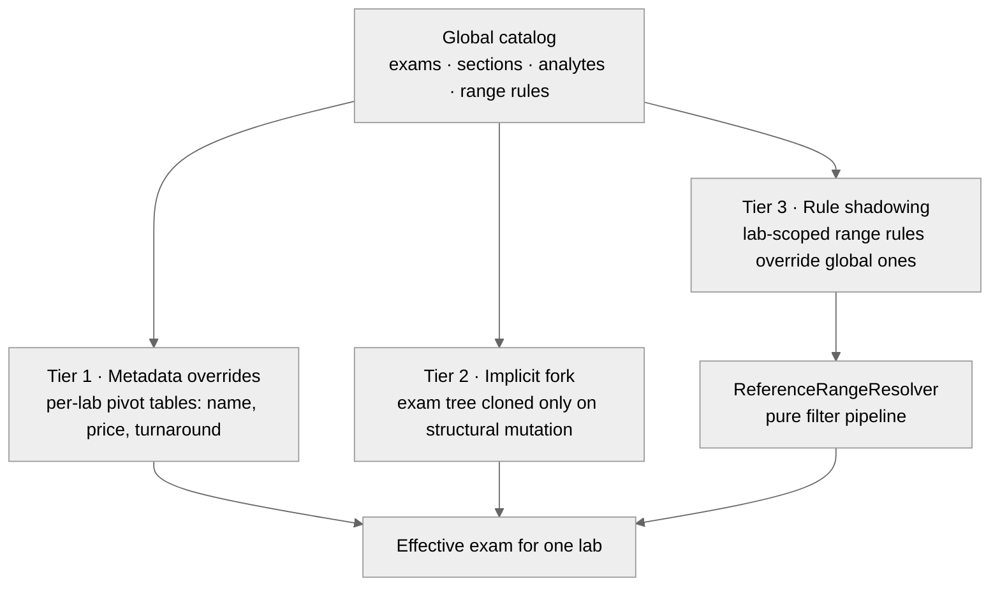
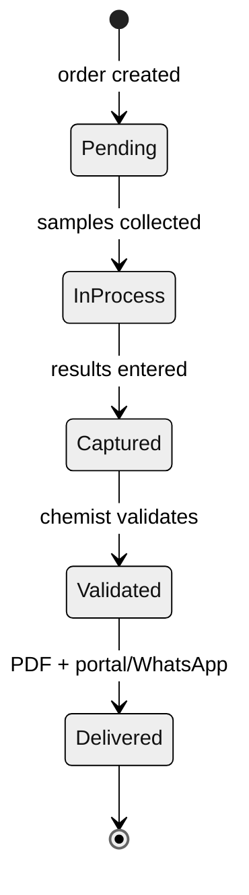

# Architecture

Lab2Next is a pnpm monorepo with three deployables: a NestJS API, a Next.js application and a marketing landing. One PostgreSQL database, tenant-partitioned by `laboratoryId`.

## System overview

## Multi-tenancy

Single database, shared schema, strict row-level discipline:

- Every tenant-owned table carries `laboratoryId`. Every service query filters by it; code review enforces this as a hard checklist item.
- Branch (`sucursal`) is a second, explicit scoping axis inside a laboratory: orders, appointments, capacity and price lists are branch-aware.
- The global exam catalog is the one deliberate exception: it is shared, and per-lab customization happens through overrides and forks (see below), never by mutating global rows.

## Authorization: PBAC in a single guard

A 3-tier chain, Plan → Claims → Quotas, evaluated by one composed `APP_GUARD`:

Platform-scope roles (the super admin operating the platform itself) are not tenants, so the tenant subscription gate does not apply to them; their access is still resolved by the same policy evaluation, against platform-scope claims that are never assignable from a lab context.

Key properties:

- **Zero DB hits per request**: the JWT carries `plan` and `permissions[]`; policies evaluate against the token, not the database.
- **One guard, ordered stages**: an earlier iteration registered the subscription check as an independent `APP_GUARD` and it silently no-opped because `request.user` did not exist yet. The fix (and the lesson) became the unified guard: any check that depends on `request.user` must run after JWT decoding inside the same guard chain.
- **Permission-driven UI, backend-enforced**: the frontend renders navigation and actions from the same claims so users never see dead-end buttons, but it is only a mirror. Every protected route is enforced server-side by the guard chain; stripping the UI would change nothing about what the API allows.

## The exam engine

The hardest design problem in the product: one curated global catalog, thousands of per-lab customizations, no duplication explosion.

- Metadata edits never fork. Forking is triggered exclusively by structural mutation, so the common case (rename, reprice) is a single pivot row.
- Reference range rules support multi-axis conditions (age, sex, physiological phase) and resolve through a pure pipeline; merge logic lives in the engine service, keeping the resolver testable in isolation.
- Result capture evaluates each value against the resolved ranges and flags H/L automatically; calculated analytes derive from sibling values.

## Public results access

Patients get results without accounts or apps:

- A signed JWT (`orderId`, read-only scope, expiry) is encoded into a QR / shareable link.
- No order id in the URL, so enumeration is impossible; a stored token hash enables revocation; expiry is configurable per laboratory.
- Public endpoints are rate limited.

## Order lifecycle and state

Payment status tracks in parallel with operational status, so reception can collect before, during or after processing.

## Backend layout: Clean Architecture Light

Deliberately pragmatic. Full rules in the [ADR summaries](adr/README.md), the short version:

- Controllers are thin: parse request, call service, return response.
- All business logic lives in `application/` services that use Prisma directly (no repository layer: a documented, revisitable decision).
- Domain layer is types only. Transactions are explicit `prisma.$transaction()` calls in services.
- Soft deletes everywhere, additive-only migrations.

## Frontend layout: feature-first

- Code lives in `features/<domain>/`, shared code must earn its place at the root.
- Pages are coordinators only (~150 lines max), tabs and modals are separate files, hard 500-line limit per component.
- TanStack Query owns all server state; mutations always invalidate.
- Server Components by default, `"use client"` only where interactivity requires it.

## Quality and safety nets

- Playwright E2E harness drives the real app (register, verify, orders, results) with video recording.
- Validation discipline: field rules are defined symmetrically on the frontend (trim/normalize) and backend (DTO decorators), with the invariant that backend caps are always >= frontend caps.
- Production backups and dev refresh are scripted and dated; destructive operations against databases are policy-forbidden.
