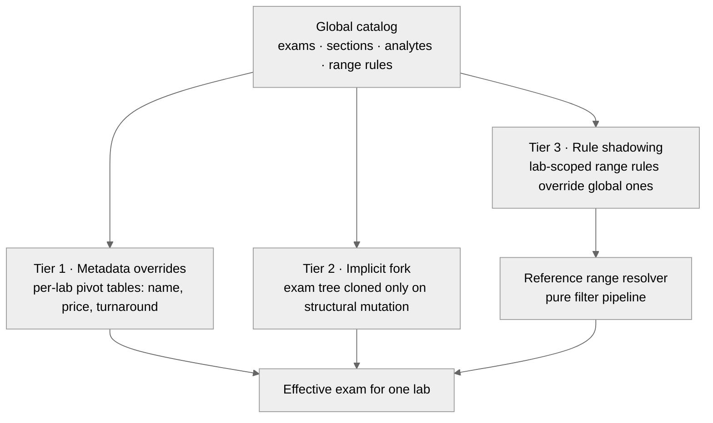
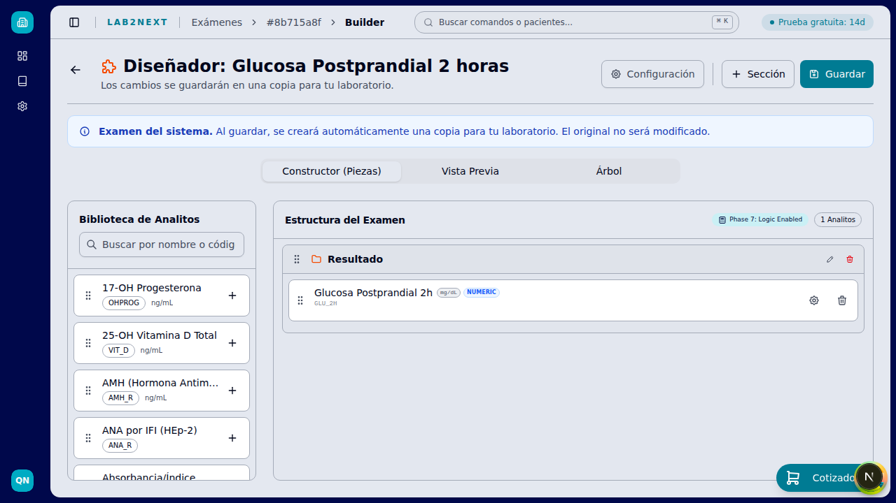

# The exam engine

The hardest design problem in the product, and the subsystem I would defend in a design review.

## The problem

Labs need standard exams from a global curated catalog (classified per the Mexican NOM-007-SSA3-2011 regulation, cross-mapped to LOINC classes). But every lab customizes: names, prices, methods, units, reference ranges, sometimes the structure of the exam itself. Two naive solutions fail immediately:

- **Copy the catalog per lab**: storage explodes, and a fix to a global exam never reaches the copies.
- **One shared catalog, no customization**: labs leave. Customization is not a nice-to-have here; a lab's exam menu is its identity.

## The solution: three tiers

### Tier 1: Metadata overrides

Commercial data (name, price, turnaround) lives in per-lab pivot tables. Renaming or repricing an exam is a single row, with zero structural duplication. This covers the overwhelming majority of customizations.

### Tier 2: Implicit forking

The exam tree is cloned for a lab only when it mutates structure: adds or removes analytes or sections. The fork is triggered exclusively by the structural mutation path, never by metadata edits, so labs that only rename and reprice never fork. After the fork, the lab owns its copy and global updates no longer apply to it, which is exactly what a lab that redesigned an exam expects.

### Tier 3: Rule shadowing

Reference ranges are where labs differ most (different populations, different equipment, different methods). Lab-scoped range rules shadow the global rules without duplicating analytes: the resolver filters global plus lab rules at evaluation time, and the lab rule wins.

## Reference range resolution

Range rules support multi-axis conditions: age, sex, and physiological phase (pediatric ranges, trimester-specific ranges for hormones, menopausal phases). Resolution is a pure filter pipeline with no side effects, which keeps it independently testable; the merge logic lives in the engine service, not the resolver.

At capture time, every value is evaluated against its resolved range and flagged H/L automatically. Calculated analytes derive from sibling values in the same capture.

| Exam builder | Analyte configuration with reference ranges |
| --- | --- |
|  |  |

## Why this shape

The constraint that drove the design: the common case (a lab adjusting commercial data) had to stay cheap forever, and the expensive case (structural divergence) had to be possible without poisoning the global catalog. Splitting those two paths explicitly, and keeping range customization as a third independent axis, is what lets one curated catalog serve every lab without a duplication explosion.

Full decision record: ADR-006 in the [ADR summaries](adr/README.md).
